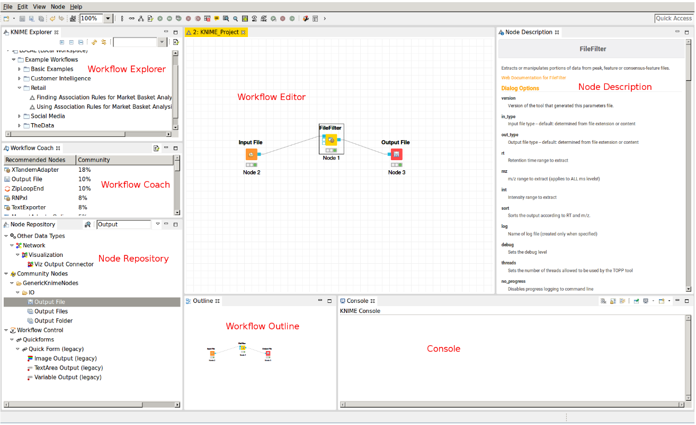
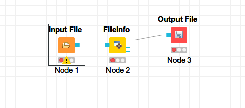

# Using KNIME with OpenMS

- __Author:__ Enes Kemal Ergin
- __Date:__ February 24 2018


KNIME is workflow engine, in which we can create, edit, open, save, and run workflows.  KNIME provides a friendly GUI also performs validity checks during the workflow editing process. In the [KNIME installation](./installation_KNIME_OpenMS.md) guide we already installed OpenMS extension but now we will install new software to go with it.

- Click on Help > Install New Software...
- From the work with drop down list select: http://update.knime.com/analytics-platform/3.5
- Now Select the following plugins form the __KNIME & Extensions__ category:
  - KNIME Base Chemistry Types & Nodes
  - KNIME Chemistry Add-Ons
  - KNIME File Handling Nodes (required for OpenMS nodes in general)
  - KNIME Interactive R Statistics Integration
  - KNIME R Statistics Integration (Windows Binaries) [Windows-only]
  - KNIME Report Designer
  - KNIME SVG Support
- Click next and follow the installation. _Don't restart yet!_
- Click again on Help > Install New Software...
- From the Work with: drop-down list select http://update.knime.com/community-contributions/trusted/3.5
- Now select the following plugin from the ”KNIME Community Contributions - Cheminformatics” category
  - RDKit KNIME integration
- Click on next and follow the installation and restart.

---

KNIME allows workflow implementation by graphically connect nodes. Nodes represent the steps of single analysis. These nodes have input and output ports. For OpenMS nodes they use a different port type called file ports representing a complete files, marked by a small blue box.

Typical OpenMS workflow in KNIME has 2 conceptually different parts:
- Nodes for signal and data processing, filtering and data reduction.
- Nodes for Downstream statistical analysis and visualization.

Nodes can have different states, indicated by small traffic light below the node:
- Red mark: Inactive, failed, not fully configured
- Yellow mark: Configured but not executed
- Green mark: successfully executed

> Advanced parameters are hidden in default since user rarely need to change them


---

## KNIME GUI:



__Workflow Editor:__

- Center of KNIME
- The nodes added here using drag-drop method

__KNIME Explorer:__ Shows list of availble workflows (projects)

__Workflow Coach:__ Based on previous selections provides list of suggesstion nodes.

__Node Repository:__

- Shows all nodes can be used in KNIME
- We will mainly use OpenMS nodes, which can be found under Community Nodes > OpenMS
- Nodes can be searched by name

__Outline:__ Provides a small overview of complete workflow.

__Console:__ Warnings and error messages are shown here.

__Node Description:__ Gives a detailed documentation about selected node from the Node Repository.

---

## Example

__Creating Workflow:__ right click in the Workflow explorer followed by clicking on _New KNIME Workflow..._

__Sharing Workflow:__ Export and Import functionality is used to share and use a shared workflow. KNIME will export worflows with ```.knwf``` extension.


Let's start our example by adding our first nodes: ```Input File``` and  ```Output File``` can be found under Community Nodes > GenericKnimeNodes > IO. We also add ```FileInfo``` from Community Nodes > OpenMS> FileHandling in between input and output. and connect them. The result should look like this:



For now their state is Red, because we didn't configure the input file. Let's select the input file by double clicking.

After selecting a file in my case I used a ```.mzML``` file.  ```Input File``` and ```FileInfo``` nodes' statuses turned to yellow from red. But the ```Output File``` still seems to stay red. We need to configure the directory location for the outputs and also don't forget to provide a name with an extension I choose ```outputed.txt```. Now ```Output File```'s state should also be Yellow.

Now it is time to execute our workflow. When you right click on anynode and click execute will do the trick. You can also do shift+F7 keyboard combination too. To inspect the results you can right click ```Output File``` node and select __View: Open the output folder__
