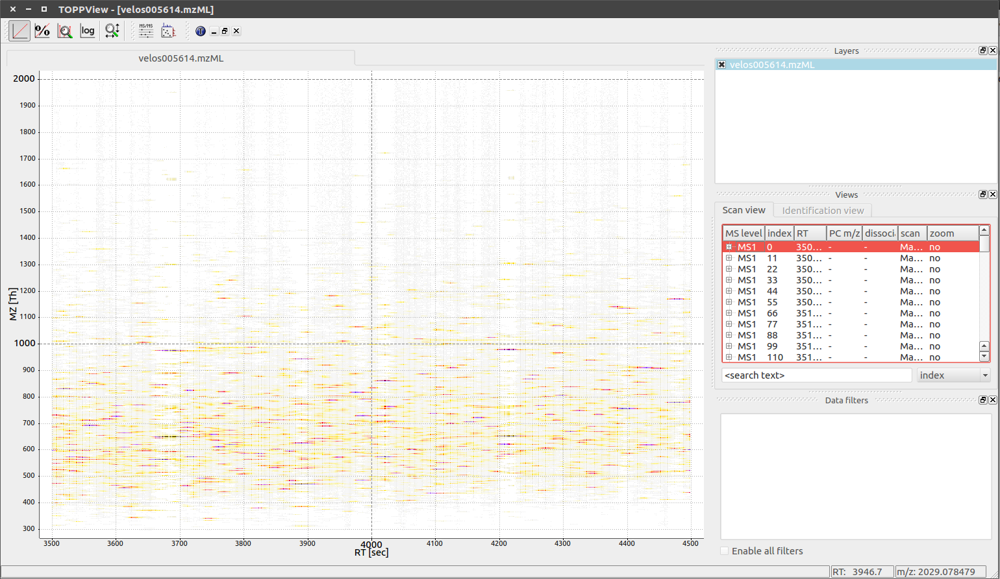
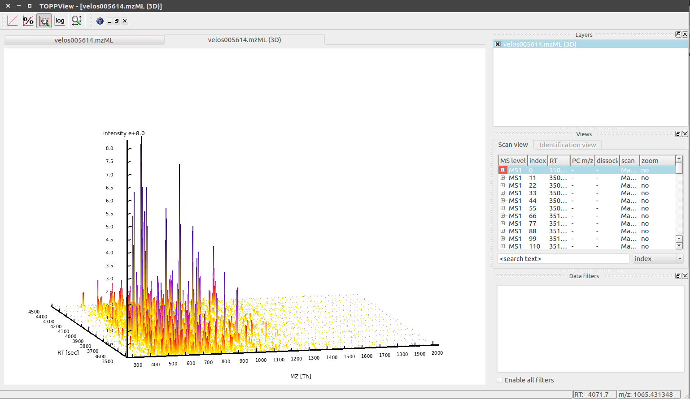
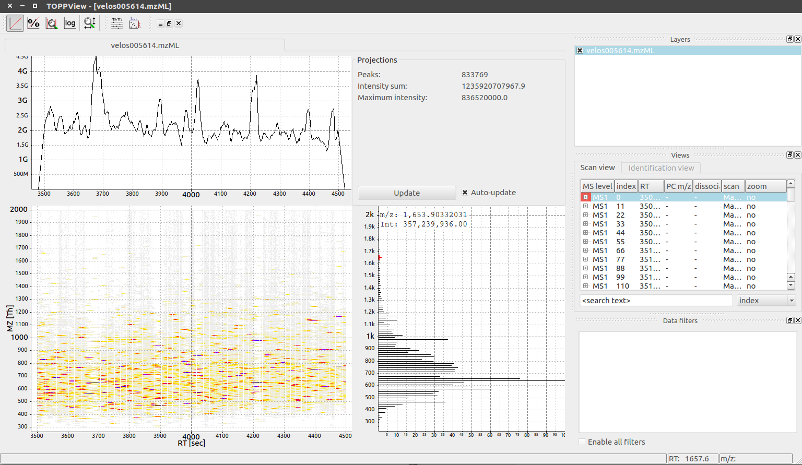

# Data Visualization using TOPPView

- __Author:__ Enes Kemal Ergin
- __Date:__ February 23 2018


Visualization is an essential part of the quality control in each step of the data analysis and processing. ```TOPPView```[1] provides a convenient data viewer for some data formats. Let's dive into the Viewer see for ourselves.

I will be using a data contains a reduced LC-MS map of a label-free proteomics platelet measurement recorded on an Orbitab velos.

```Bash
# Have a peak at the data and what the format
less velos005614.mzML
# This will show a format that is really close to XML

# Now Let's open the actual visualization

# In the command line just
TOPPView velos005614.mzML
```

The default result is a 2D Map View of the LC-MS output on a global view mode which looks like this:





There are 3 modes allowing to interact with the displayed data;

- Scroll Mode:
  - Allowed in default
  - Browsing data by moving around in RT and m/z range.
- Zoom Mode:
  - Self explantory
- Measure Mode
  - Activated using shift key
  - Press the left mouse button down while a peak is selected and drag the mouse to another peak to measure the distance between peaks.
  - In 1D and 2D mode only.

We can change the mode to 3D mode by right click on the plot and select __switch to 3D view__ and here is how it looks (pretty awesome to me.)



There are much more we can view such as changing the normalization modes using 4 options on the top toolbar. We can also add the projections to the data to see overall change, allows more convenient quality check. Here you can see how it looks when the projections option selected from the top toolbar.




## References

1. Sturm, M. & Kohlbacher, O. TOPPView: An Open-Source Viewer for Mass Spectrometry Data. Journal of Proteome Research 8, 3760–3763 (2009).

> OpenMS Available at: [Website](https://www.openms.de/)
